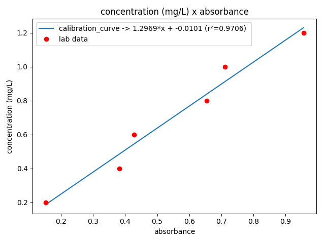

# Calibration Curve

### Overview
Application that receives absorbance values and concentrations collected 
from the chemistry laboratory, calculates the curve coefficients and plots 
the graph

### Technologies
- Python 3.6.9
- Numpy
- Matplotlib

### Chart Output
